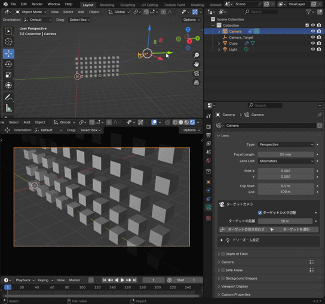
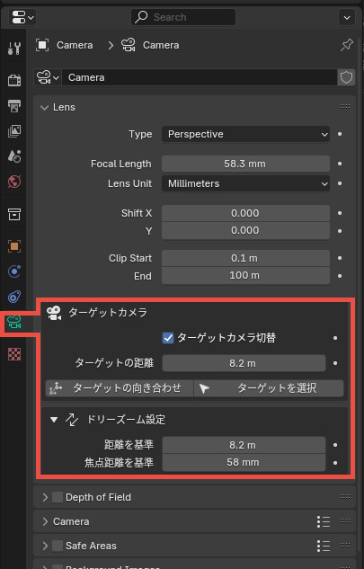

# Target Camera and Dolly Zoom for Blender

Blenderのカメラに以下の機能を提供します。

1. 標準カメラとターゲットカメラの切替
2. ドリーズーム機能

## ターゲットカメラ機能

- 目標点（ターゲット）を注視するターゲットカメラと、標準カメラの切り換え
- カメラからターゲットまでの距離を調整
- ターゲットの回転をカメラに一致

## ドリーズーム機能

- **ターゲットカメラ時のみ有効**
- カメラのドリー（前後移動）と、ズームを同時調整

## インストール方法（Blender 4.2.7 LTS）

1. 右上のCodeから、zipファイルをダウンロード
2. Blenderを起動し、 `Edit > Preferences > Get Extensions` を開く
3. 右上のトグルボタンから`Install from Disk` をクリックし、ダウンロードしたzipファイルを選択
4. チェックボックスをオンにして有効化

追加される場所はカメラのデータプロパティ

## 仕様

このアドオンは「漫画のカメラアングル検討」のために作りました。
シンプルに、複雑なリグを組まないことを優先しています。
そのため、以下のような仕様となっています。

- 「カメラのロール角」は無視されます
- カメラそのものにリグやペアレントを組む場合、意図せぬエラーが出る可能性があります。
  - 様々なケースを想定してエラー対策をするのは難しいので、よほどのことが無い限り修正はしません。

カメラロールを維持したい場合は、このアドオンは使用せず、以下のようなリグが良さそうです

- Position Empty
  - Rotation Empty
    - Roll Empty
      - Camera
- Target Empty

Rotation Emptyにトラックコンストレインを適応、ロール角度はRoll Emptyで制御する。

動作確認は Blender 4.2.7 LTS、3.6.4 LTSで行っています。
